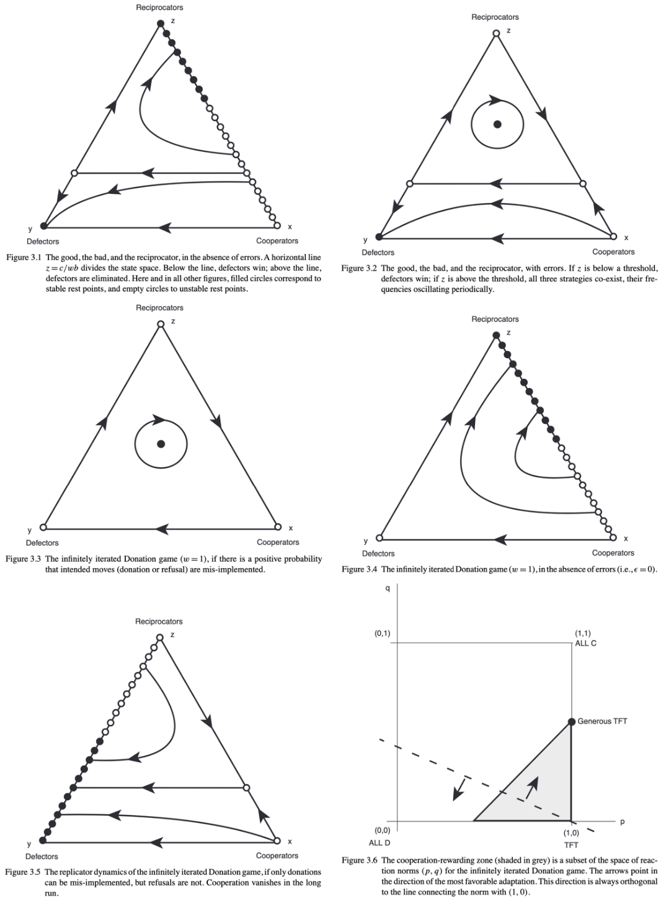

# Iterated prisoner's dilemma with mathematical and computational analysis

This is my paper analysing Prisoner's Dilemma from the computational and mathematical (markov + dynamical system) lenses. This exposé discusses dominant, noisy, isolatory, extortionate, reciprotory, and self-made strategies - all of which are then analysed computationally. Strategies are motivated by the initial Axelrod tournament, results, and proceeding discussion. Some stretegies hold assumptions which work well in some scenarios and not in others, and this is discussed along with forming a 'newer' generation of memory-1 strategies to fuzzily compete against what was considered the reasons for winning priorly.

